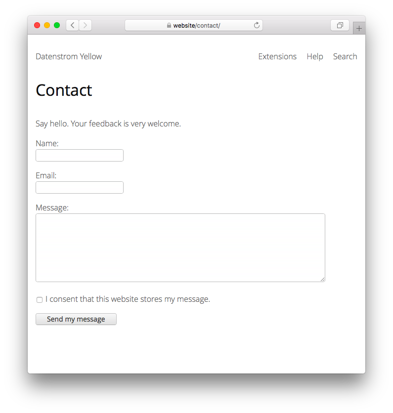

<a href="README-de.md">Deutsch</a> &nbsp; <a href="README.md">English</a> &nbsp; <a href="README-sv.md">Svenska</a>

# Contact 0.8.23

E-post kontaktsida.

## Hur man installerar ett tillägg

[Ladda ner ZIP-filen](https://github.com/annaesvensson/yellow-contact/archive/refs/heads/main.zip) och kopiera den till din `system/extensions` mapp. [Läs mer om tillägg](https://github.com/annaesvensson/yellow-update/tree/main/README-sv.md).

## Hur man använder en kontaktsida

Kontaktsidan finns tillgänglig på din webbplats som `http://website/contact/`. Webmasterns email definieras i filen `system/extensions/yellow-system.ini`. Du kan ställa in en annan `Author` and `Email` i [sidinställningar](https://github.com/annaesvensson/yellow-core/tree/main/README-sv.md#inställningar-page) högst upp på en sida. För att visa ett kontaktformulär på din webbplats, använd en `[contact]` förkortning.

## Hur man begränsar en kontaktsida

Om du inte vill att meddelanden ska skickas till vilken kontaktperson som helst begränsar du email. Öppna filen `system/extensions/yellow-system.ini` och ändra `ContactEmailRestriction: 1`. Alla kontaktmeddelanden går direkt till webmastern och det är inte längre möjligt att ställa in en annan kontaktperson i [sidinställningar](https://github.com/annaesvensson/yellow-core/tree/main/README-sv.md#inställningar-page) högst upp på en sida.

Om du inte vill att meddelanden med länkar ska skickas begränsar du länkar. Öppna filen `system/extensions/yellow-system.ini` och ändra `ContactLinkRestriction: 1`. Kontaktmeddelanden får då inte innehålla klickbara länkar, detta blockerar många oönskade meddelanden. Du kan också ställa in nyckelord i skräppostfiltret, lyckligtvis skickar många spammare samma meddelande flera gånger. 

## Exempel

Visa ett kontaktformulär:

    [contact]
    [contact /contact/]
    [contact /sv/contact/]

Innehållsfil med kontaktformulär:

    ---
    Title: Exempelsida
    ---
    Lorem ipsum dolor sit amet, consectetur adipisicing elit, sed do eiusmod tempor incididunt ut 
    labore et dolore magna pizza. Ut enim ad minim veniam, quis nostrud exercitation ullamco laboris 
    nisi ut aliquip ex ea commodo consequat. Duis aute irure dolor in reprehenderit in voluptate velit 
    esse cillum dolore eu fugiat nulla pariatur. Excepteur sint occaecat cupidatat non proident, sunt 
    in culpa qui officia deserunt mollit anim id est laborum.

    [contact]

Innehållsfil med en annan kontaktperson på kontaktsidan:

    ---
    Title: Exempelsida
    ---
    Lorem ipsum dolor sit amet, consectetur adipisicing elit, sed do eiusmod tempor incididunt ut 
    labore et dolore magna pizza. Ut enim ad minim veniam, quis nostrud exercitation ullamco laboris 
    nisi ut aliquip ex ea commodo consequat. Duis aute irure dolor in reprehenderit in voluptate velit 
    esse cillum dolore eu fugiat nulla pariatur. Excepteur sint occaecat cupidatat non proident, sunt 
    in culpa qui officia deserunt mollit anim id est laborum.
    
    [Kontakta en människa](/contact/).

Innehållsfil med en annan kontaktperson på kontaktsidan:

     ---
     Title: Kontakta en människa
     TitleSlug: Contact
     Layout: contact
     Status: unlisted
     Author: Anna Svensson
     Email: anna@svensson.com
     ---

Konfigurera olika skräppostfilter i inställningar:

    ContactSpamFilter: advert|promot|market|click here
    ContactSpamFilter: advert|buy|likes|followers|subscribers
    ContactSpamFilter: advert|köp|sälj|rabatt|sökmotoroptimering

## Inställningar

Följande inställningar kan konfigureras i filen `system/extensions/yellow-system.ini`:

`Author` = webmasterns namn  
`Email` = webmasterns email  
`ContactSiteEmail` = webbplatsens email, som används för genererade meddelanden  
`ContactLocation` = plats för kontaktsidan  
`ContactEmailRestriction` = aktivera emailbegränsning, 1 eller 0  
`ContactLinkRestriction` = aktivera länkbegränsning, 1 eller 0  
`ContactSpamFilter` = skräppostfilter som reguljära uttryck, `none` för att inaktivera  

Följande filer kan anpassas:

`system/layouts/contact.html` = layoutfil för kontaktsida  

## Utvecklare

Anna Svensson. [Få hjälp](https://datenstrom.se/sv/yellow/help/).
