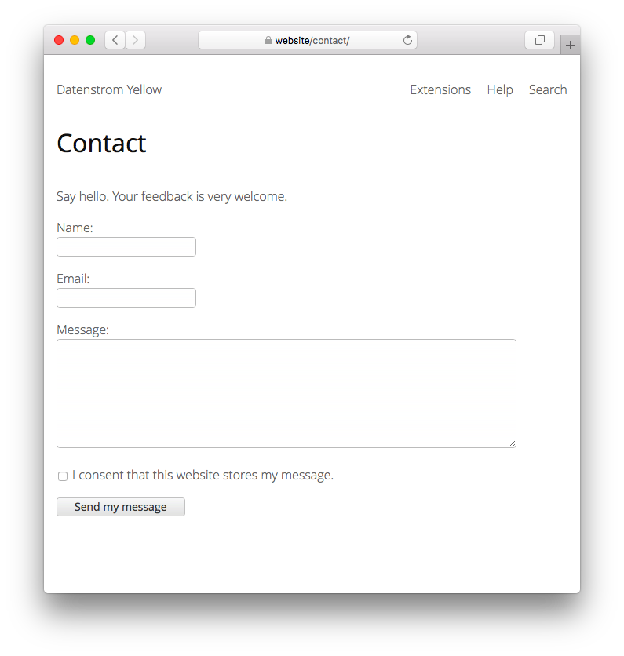

# Contact 1.0.1

Contact form for sending emails. Developed by Anna Svensson.

## How to install an extension

[Download ZIP file](https://github.com/annaesvensson/yellow-contact/archive/refs/heads/main.zip) and copy it into your `system/extensions` folder. [Learn more about extensions](https://github.com/annaesvensson/yellow-update).

## How to use a contact form

The contact form is available on your website as `http://website/contact/`. Usually all messages entered in the contact form are sent to the webmaster. The webmaster's email is defined in file `system/extensions/yellow-system.ini`. You can set a different `Author` and `Email` in the [page settings](https://github.com/annaesvensson/yellow-core#settings-page) at the top of a page.

## How to restrict a contact form

If you don't want that messages are sent to any contact person, then restrict emails. Open file `system/extensions/yellow-system.ini` and change `ContactEmailRestriction: 1`. All messages go directly to the webmaster and it's no longer possible to set a different contact person in the [page settings](https://github.com/annaesvensson/yellow-core#settings-page) at the top of a page.

## How to protect a contact form from spam

You can protect your contact form from spam, bots and advertising. Open file `system/extensions/yellow-system.ini` and change `ContactLinkRestriction: 1`. Messages must not contain clickable links, this blocks many unwanted messages. You can also configure keywords in the spam filter, fortunately, many spammers send the same message multiple times.

We are experimenting with additional protections mechanisms and your feedback is very welcome.

## Examples

Content file for contact form:

    ---
    Title: Contact a human
    TitleSlug: Contact
    Layout: contact
    Status: unlisted
    --- 

Content file for contact form with a different contact person:

    ---
    Title: Contact a human
    TitleSlug: Contact
    Layout: contact
    Status: unlisted
    Author: Anna Svensson
    Email: anna@svensson.com
    ---

Content file with link to contact form:

    ---
    Title: Example page
    ---
    Lorem ipsum dolor sit amet, consectetur adipisicing elit, sed do eiusmod tempor incididunt ut 
    labore et dolore magna pizza. Ut enim ad minim veniam, quis nostrud exercitation ullamco laboris 
    nisi ut aliquip ex ea commodo consequat. Duis aute irure dolor in reprehenderit in voluptate velit 
    esse cillum dolore eu fugiat nulla pariatur. Excepteur sint occaecat cupidatat non proident, sunt 
    in culpa qui officia deserunt mollit anim id est laborum.

    [Contact a human](/contact/).

Configuring different spam filters in the settings:

    ContactSpamFilter: advert|promot|market|click here
    ContactSpamFilter: advert|buy|likes|followers|subscribers
    ContactSpamFilter: advert|buy|sell|discount|search engine optimisation

## Settings

The following settings can be configured in file `system/extensions/yellow-system.ini`:

`Author` = name of the webmaster  
`Email` = email of the webmaster  
`From` = email for outgoing messages  
`ContactLocation` = contact page location  
`ContactEmailRestriction` = enable email restriction, 1 or 0  
`ContactLinkRestriction` = enable link restriction, 1 or 0  
`ContactSpamFilter` = spam filter as regular expression, `none` to disable  

The following files can be customised:

`system/layouts/contact.html` = layout file for contact page  

Do you have questions? [Get help](https://datenstrom.se/yellow/help/).
